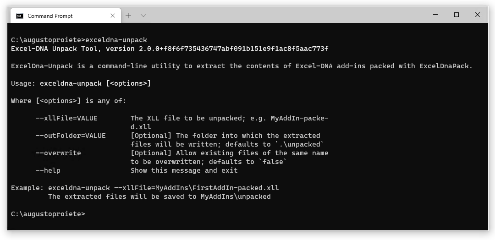

| README.md |
|:---|

<div align="center">


</div>

<h1 align="center">ExcelDna-Unpack</h1>
<div align="center">

Command-line utility to extract the contents of Excel-DNA add-ins that have been packed with ExcelDnaPack

[](https://www.nuget.org/packages/exceldna-unpack) [](http://stackoverflow.com/questions/tagged/excel-dna)



</div>

## Give a Star! :star:

If you like or are using this project please give it a star. Thanks!

## Getting Started :rocket:

ExcelDna-Unpack can be downloaded as a standalone and portable executable, or installed as a [.NET Core tool](https://docs.microsoft.com/en-us/dotnet/core/tools/global-tools).

### Installation (Standalone)

Download the latest version of ExcelDna-Unpack from the [Releases tab](https://github.com/augustoproiete/exceldna-unpack/releases), and extract the file `exceldna-unpack-{version}-{rid}.zip` to the location where your `.xll` add-in is stored.

- `{version}` is the version of the ExcelDna-Unpack tool (latest version is recommended)
- `{rid}` is the runtime identifier: Choose `win-x64` for 64-bit or `win-x86` for 32-bit

### Installation (.NET Core Tool)

Download and install the [.NET Core 3.0 SDK](https://www.microsoft.com/net/download) or newer. Once installed, run the following command:

```bash
dotnet tool install --global exceldna-unpack
```

If you already have a previous version of **exceldna-unpack** installed, you can upgrade to the latest version using the following command:

```bash
dotnet tool update --global exceldna-unpack
```

### Usage

Run `exceldna-unpack --xllFile=NameOfYourAddIn.xll`

```
Usage: exceldna-unpack [<options>]

Where [<options>] is any of:

--xllFile=VALUE    The XLL file to be unpacked; e.g. MyAddIn-packed.xll
--outFolder=VALUE  [Optional] The folder into which the extracted files will be written; defaults to `.\unpacked`
--overwrite        [Optional] Allow existing files of the same name to be overwritten; defaults to `false`

Example: exceldna-unpack --xllFile=MyAddIns\FirstAddIn-packed.xll
         The extracted files will be saved to MyAddIns\unpacked
```

## Release History

Click on the [Releases](https://github.com/augustoproiete/exceldna-unpack/releases) tab on GitHub.

---

_Copyright &copy; 2014-2020 C. Augusto Proiete & Contributors - Provided under the [Apache License, Version 2.0](LICENSE)._
